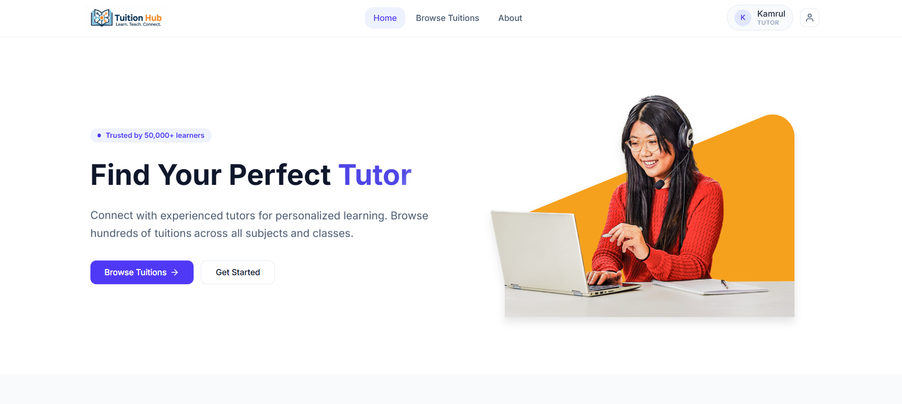
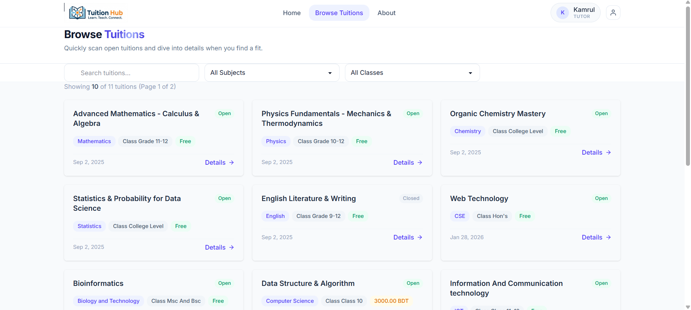
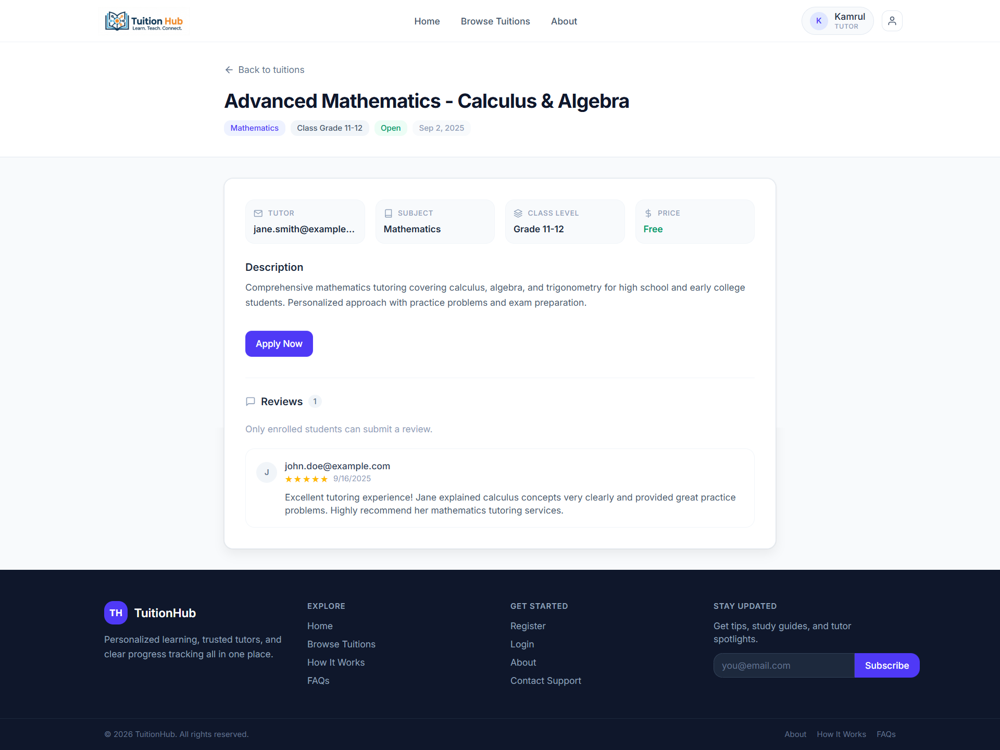
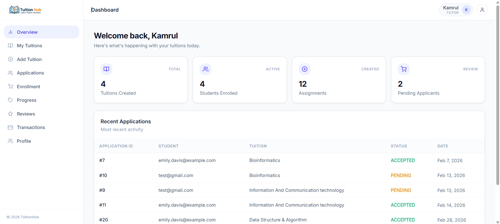
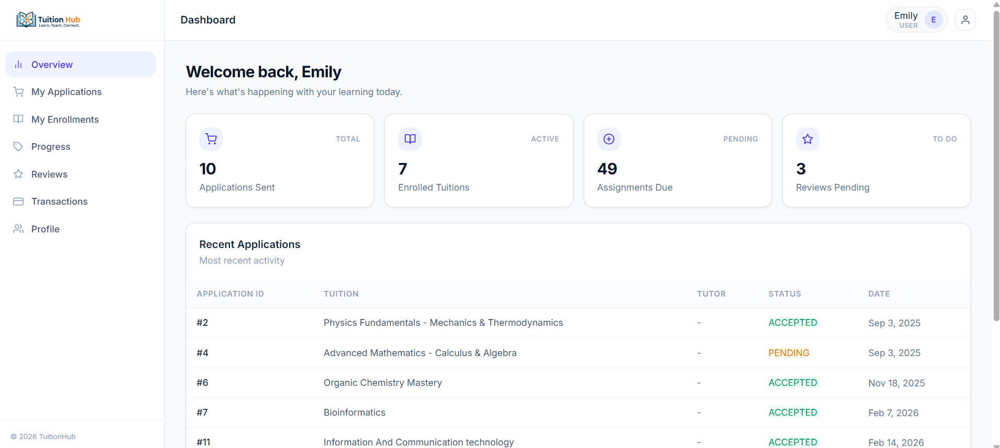
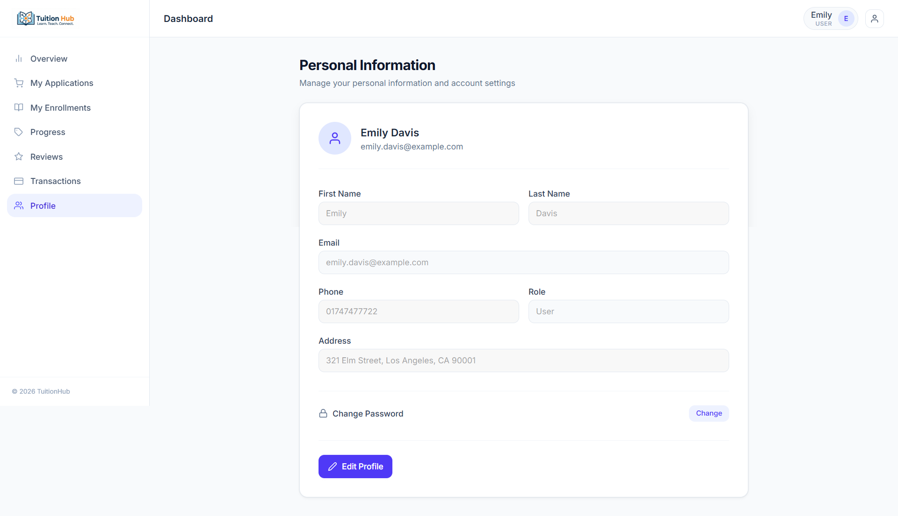
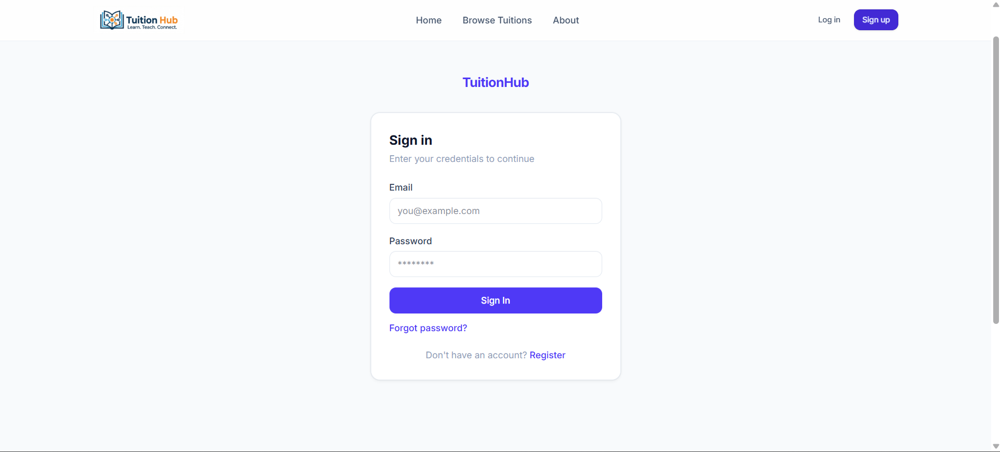
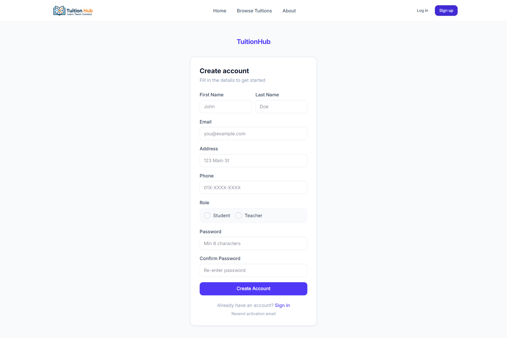

<div align="center">


# TuitionHub

### A full-stack online tuition management platform that bridges the gap between students/parents and tutors — enabling discovery, application, progress tracking, and reviews in one seamless experience.

<br/>

[](https://tuition-hub-client.vercel.app/)
[](https://tuitionhub-rho.vercel.app/api/v1/)
[](https://tuitionhub-rho.vercel.app/swagger/)

[](https://github.com/Kamrul785/TuitionHub-Client/tree/version3)
[](https://github.com/Kamrul785/Tuition-Hub)

</div>

---

## 📸 Screenshots

> Below is a visual walkthrough of the key pages in TuitionHub.

### 🏠 Home Page — Hero Section

> Animated hero section with CTA buttons, stats highlights, and quick access to tuition discovery.

### 📋 Tuition List / Features


> Explore available tuitions with filters like class, subject, and tutor name.

### 📊 Tutor Dashboard

> Dashboard cards and panels for tutor activity, tuition management, and application handling.

### 👤 Student Dashboard

> Student-focused view for enrolled tuitions, progress tracking, and key actions.

### 👤 Profile Settings

> Profile update and password change section for account management.

### 🔐 Authentication Pages


> Clean login and registration forms with validation, role-based registration, and account activation flow.

---

## 📌 Project Overview

**TuitionHub** is a role-based tuition marketplace platform built for two types of users:

- 🎓 **Students / Parents** — Search tuitions, apply, track learning progress, and leave reviews
- 👨‍🏫 **Tutors** — Post and manage tuition listings, accept applicants, assign topics and homework

The system is designed with scalability in mind, including a placeholder architecture for a future **payment gateway** (tuition fees, tutor earnings, transaction history).

---

## 🔑 Demo Credentials

| Role    | Email                          | Password   |
|---------|-------------------------------|------------|
| 🎓 Student | `emily.davis@example.com`   | `T@est123` |
| 👨‍🏫 Tutor   | `kamrulkhan526785@gmail.com` | `T@est123` |

> ⚠️ These are read-only demo accounts. Please do not change passwords.

---

## ✨ Features

### 🔐 User Registration & Authentication
- Dual-role system: **User (Student/Parent)** and **Tutor**
- Separate registration and login flows per role
- **Email verification** for both roles on signup
- JWT-based secure session management

### 📝 Tuition Management *(Tutors only)*
- Create tuition listings with: title, description, class, subject, availability, and more
- Edit or delete existing listings
- View and manage all applicants for each tuition
- **Select** an applicant to enroll them

### 🔍 Search & Filter *(Students)*
- Browse all available tuitions
- Filter by **class**, **subject**, or **tutor name**
- View full tuition detail pages
- One-click **Apply** button on tuition detail page

### 👤 Profiles
- Students: view applied tuitions + enrolled tuition history
- Tutors: view all posted tuitions
- Both roles: update password from profile settings

### 📈 Tuition Progress Tracking
- **Tutors** can mark topics as completed and add assignments per student
- **Students** can view their progress: completed topics and pending assignments
- Real-time progress visibility for enrolled tuitions

### ⭐ Reviews & Ratings
- Students can leave reviews **only after being selected/enrolled**
- Prevents fake or unverified reviews

### 💳 Payments & Transactions *(Backend-dependent)*
- Transaction history page for students/tutors
- Invoice view with printable layout
- Payment success/fail routes for redirect handling
- Frontend hooks already consume payment endpoints (`/payments/my_payments/`, `/payments/:id/`)

---

## 🛠 Tech Stack

### Frontend

| Package | Version | Purpose |
|---|---|---|
| `react` | ^19.2.0 | Core UI library |
| `react-dom` | ^19.2.0 | DOM rendering |
| `react-router` | ^7.10.0 | Client-side routing |
| `vite` | ^7.2.4 | Build tool & dev server |
| `tailwindcss` | ^4.1.17 | Utility-first CSS framework |
| `@tailwindcss/vite` | ^4.1.17 | Tailwind v4 Vite plugin |
| `daisyui` | ^5.5.8 | Tailwind component library (theme: coffee) |
| `axios` | ^1.13.4 | HTTP client for API calls |
| `react-hook-form` | ^7.71.1 | Performant form handling |
| `primereact` | ^10.9.7 | Advanced UI components |
| `motion` | ^12.31.0 | Animations (Framer Motion) |
| `swiper` | ^12.1.0 | Touch sliders & carousels |
| `react-icons` | ^5.5.0 | Icon library |
| `ogl` | ^1.0.11 | WebGL/3D graphics utility |

### Backend

| Technology | Purpose |
|---|---|
| Django | Backend web framework |
| Django REST Framework (DRF) | REST API development |
| Supabase (PostgreSQL) | Database and hosted backend services |
| JWT | Token-based authentication |
| Swagger / OpenAPI | API documentation |


### DevOps & Tooling

| Tool | Usage |
|---|---|
| Vercel | Frontend & Backend deployment |
| ESLint 9 | Linting with React Hooks + React Refresh plugins |
| `@vitejs/plugin-react` | Babel-based React Fast Refresh |
| `vercel.json` | SPA rewrites, security headers, asset caching |

---

## 🚀 Getting Started — Run Locally

### 1. Clone the Frontend Repository

```bash
git clone https://github.com/Kamrul785/TuitionHub-Client.git
cd TuitionHub-Client
git checkout version3
```

### 2. Install Dependencies

```bash
npm install
```

### 3. Configure Backend API Base URL

This project currently uses hardcoded API base URLs in:

- `src/services/api-client.js`
- `src/services/auth-api-client.js`

Default value:

```txt
https://tuitionhub-rho.vercel.app/api/v1
```

To run against a local backend, change both files to:

```txt
http://localhost:5000/api/v1
```

Then run the backend from the [Tuition-Hub API repo](https://github.com/Kamrul785/Tuition-Hub).

### 4. Start the Development Server

```bash
npm run dev
```

App runs at → [http://localhost:5173](http://localhost:5173)

### 5. Build for Production

```bash
npm run build
npm run preview   # preview the production build locally
```

---

## 🗂 Folder Structure

```
tuition-hub-client/
├── screenshorts/                     # Project screenshots used in README
│   ├── Home1.png
│   ├── browseTuition.png
│   ├── TuitionDetails.png
│   ├── TutorDashboard.png
│   ├── StudentDashboard.png
│   ├── ProfileSection.png
│   ├── Login.png
│   └── ResistrationPage.png
├── public/                          # Static assets
│   ├── tuition-hub.svg
│   └── vite.svg
├── src/
│   ├── api/                         
│   ├── assets/                      # Images and logos
│   ├── components/
│   │   ├── Animations/
│   │   ├── Applications/
│   │   ├── Categories/
│   │   ├── Dashboard/
│   │   │   └── Profile/
│   │   ├── Enrollments/
│   │   ├── Home/
│   │   ├── PasswordReset/
│   │   ├── Products/
│   │   ├── Registrations/
│   │   ├── StudentProgress/
│   │   ├── Tuitions/
│   │   ├── ui/
│   │   └── PrivateRoute.jsx
│   ├── context/
│   │   └── AuthContext.jsx
│   ├── data/
│   │   └── categories.js
│   ├── hooks/
│   │   ├── FetchTuition.js
│   │   ├── useAuth.js               # Core API/auth/data hook
│   │   └── useAuthContext.js
│   ├── Layout/
│   │   ├── DashboardLayout.jsx
│   │   ├── MainLayout.jsx
│   │   └── Navbar.jsx
│   ├── pages/                       # Route-level pages (flat structure)
│   ├── routes/
│   │   └── AppRoutes.jsx
│   ├── services/
│   │   ├── api-client.js
│   │   └── auth-api-client.js
│   ├── utils/
│   ├── App.jsx
│   ├── App.css
│   ├── index.css
│   └── main.jsx
├── back_end_guide.txt
├── eslint.config.js
├── index.html
├── package.json
├── vercel.json
└── vite.config.js
```

---

## 🔮 Future Improvements
- [ ] **💬 Real-time Chat** — Socket.IO messaging between students and tutors
- [ ] **🔔 Notifications** — In-app + email alerts for application status, new assignments
- [ ] **📅 Scheduling & Calendar** — Google Calendar sync for tuition sessions
- [ ] **🎥 Video Lessons** — Embedded video calling (Daily.co / Jitsi) or recorded lesson uploads
- [ ] **📱 Mobile App** — React Native version for iOS & Android
- [ ] **🛡 Admin Panel** — Platform-level moderation, user management, flagged review handling
- [ ] **🌐 Multilingual Support** — Bengali + English i18n for wider local reach

---

## 👨‍💻 Author

**Kamrul Khan**

[](https://github.com/Kamrul785)
[](https://www.linkedin.com/in/kamrulhasan7/)
[](https://kamrulhasan-henna.vercel.app/)

---

## 📄 License

This project is open source and available under the [MIT License](LICENSE).

---

<div align="center">
  <sub>Built with ❤️ using React 19 · Vite 7 · TailwindCSS 4 · DaisyUI 5</sub>
</div>